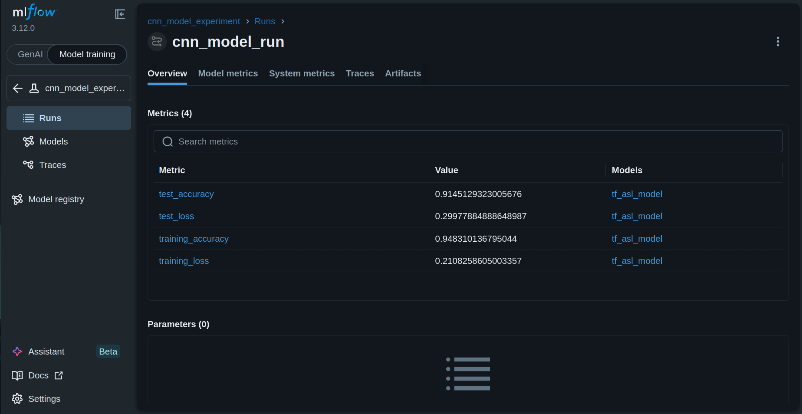
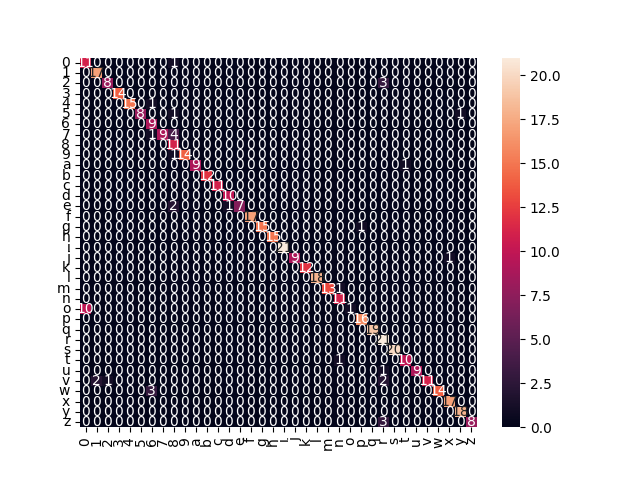

# ASL Image Classification MLOps Pipeline

An end-to-end MLOps project for American Sign Language (ASL) image classification using TensorFlow, ZenML, and MLflow.

## Overview

This project implements a reproducible machine learning workflow for classifying ASL hand signs from images. The pipeline automates data loading, preprocessing, model training, evaluation, experiment tracking, and artifact management.

## Features

* Image classification using Convolutional Neural Networks (CNN)
* Automated workflow orchestration with ZenML
* Experiment tracking with MLflow
* Early stopping and learning rate scheduling
* Training and validation monitoring
* Confusion matrix generation
* Artifact logging and model versioning

## Pipeline

1. Load image dataset
2. Resize and normalize images
3. Encode class labels
4. Split data into training and testing sets
5. Train CNN model
6. Evaluate model performance
7. Log metrics, artifacts, and trained model to MLflow

## Technology Stack

* Python
* TensorFlow / Keras
* ZenML
* MLflow
* Scikit-Learn
* NumPy
* Matplotlib
* Seaborn

## Project Structure

```text
src/
├── data_loader.py
├── preprocessing.py
├── split.py
├── model.py
├── train.py
├── pipeline.py
└── main.py
```

## Installation

```bash
pip install -r requirements.txt
```

## Run the Pipeline

```bash
python src/main.py
```

## Logged Metrics

* Training Accuracy
* Training Loss
* Test Accuracy
* Test Loss

## Logged Artifacts

* Loss Curve
* Confusion Matrix
* Trained TensorFlow Model

## Future Improvements

* Docker containerization
* CI/CD integration with GitHub Actions
* Model deployment using FastAPI
* Automated testing and validation
* Data and model versioning

## MLflow Experiment Tracking



## Confusion Matrix



## Training Curve


